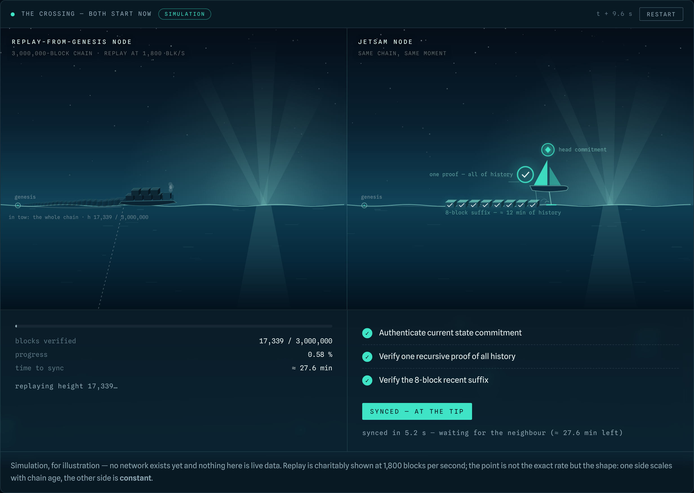
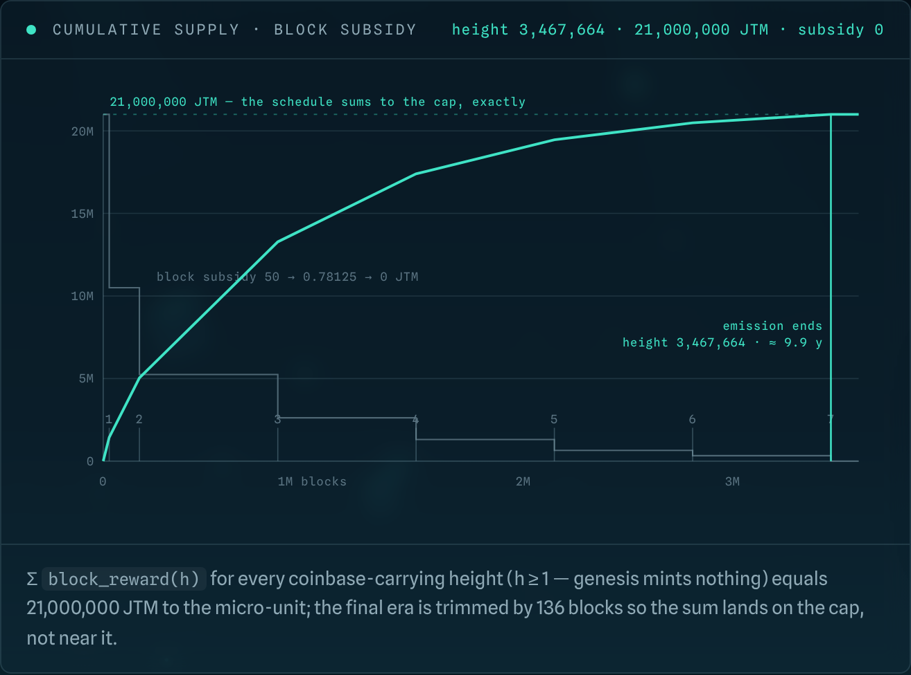
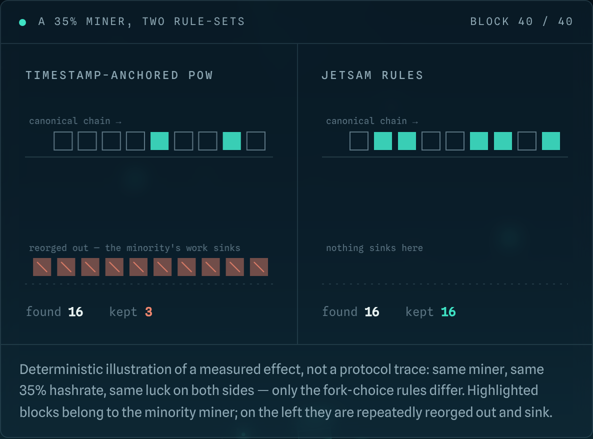

<p align="center">
  
</p>

<p align="center">
  
  
  
  
  
  
</p>

<p align="center">
  <b>Proof-native Layer 1 ordered by proof of work. 21,000,000 JTM, zero premine.</b><br>
  <sub>
    <a href="https://jetsamchain.com">Website</a> ·
    <a href="https://explorer.jetsamchain.com">Explorer</a> ·
    <a href="https://discord.gg/yjNgkyEw2W">Discord</a> ·
    <a href="docs/index.md">Documentation</a> ·
    <a href="docs/architecture/overview.md">Architecture</a> ·
    <a href="CHANGES-FROM-UPSTREAM.md">Changes from upstream</a> ·
    <a href="https://github.com/jetsam-chain/jetsam/releases">Releases</a>
  </sub>
</p>

---

> **Status: mainnet.** The Jetsam network is live and producing blocks under
> the emission schedule below. Genesis is
> `6e592c07be6fd1b4259eeacbf4eb7eb2948a77f1d02626a12fdab42c448c5f44`; the
> current height is visible at
> [explorer.jetsamchain.com](https://explorer.jetsamchain.com). Every figure in
> this document is a protocol constant or a measurement, each labelled as such.

Blockchains have a fundamental architectural flaw: the present does not prove
itself. Its validity is inherited from accumulated history. Bitcoin reconstructs
that validity by validating the chain from genesis. Other networks may shorten
bootstrap with snapshots or checkpoints, but those only move the dependency
forward: the current state still does not carry a proof of its own valid path
from genesis.

A new verifier must therefore reconstruct that path or rely on state produced
by prior historical validation.

This is not a temporary limitation. It is baked into the model.

Jetsam removes this requirement.

In Jetsam, validity is established once, where the complete information
already exists. Authorization is proved locally by the party with the private
witness — the wallet owner. The miner proves the public transaction logic and
the exact state transition. The network verifies those proofs instead of
repeating the same execution.

Every accepted block carries a recursive `HistoryStep` that proves the block's
exact state transition, including its new UTXO root, and verifies the preceding
`HistoryStep` terminal. A new node can therefore authenticate the current state
and verify the recent reorg suffix without executing the chain from genesis —
synchronization cost is constant in chain age.

Once the present state carries its own proof, a different architecture becomes
possible. Spent state can be deleted and reused. Ownership no longer needs a
public key or digital signature. State growth can be priced directly. Proof of
work can order transitions whose validity is already established. The result
is an L1 whose age does not become a hardware requirement. Years later, an
ordinary laptop can still hold the complete live state and independently
verify the network without replaying the chain's lifetime.

## What that looks like

**Two nodes join the same chain at the same moment.** One replays three million
blocks. The other authenticates the head, verifies one recursive proof of all
history, checks an 8-block suffix — and is at the tip.

<p align="center">
  
</p>

**The subsidy reaches exactly zero.** Seven halvings by height, ending at height
3,467,664 — about 9.9 years in. The schedule sums to the cap to the micro-unit;
the final era is trimmed by 136 blocks so the total lands *on* 21,000,000, not
near it.

<p align="center">
  
</p>

**Blocks you find are blocks you keep.** On the codebase Jetsam descends from, a
miner producing ~35% of blocks kept roughly 3% of them — difficulty read from a
block's own timestamp, and an interval below prover latency. Jetsam anchors
difficulty on the parent and mines 90 s blocks.

<p align="center">
  
</p>

## The Fundamental Shift

| | Conventional blockchain | Jetsam |
|---|---|---|
| Validation | Every full node re-executes | The witness holder proves; the network verifies |
| Bootstrap | Rebuild state from genesis | Authenticate current state and verify the recent suffix |
| Ownership | Public-key signature | Fresh ZK proof of a Poseidon2b preimage |
| State | Derived from accumulated history | Exact live UTXO state is a consensus object |
| Spent outputs | Remain part of required history | Slots are cleared and safely reused |
| Proof of work | Orders an execution log | Orders proof-valid state transitions |
| Post-quantum migration | Replace the ownership scheme | No elliptic-curve transaction scheme to replace |

Jetsam is transparent, not a privacy chain. Current values and owners are
public, and transactions are visible when relayed. The protocol turns history
into proof: every node carries an authenticated present instead of an
ever-growing transaction graph. Anyone may build an external tracer, but it
must record the entire transaction stream for itself; the network does not
make every node carry that burden. Privacy here comes from non-retention, not
concealment. Zero knowledge protects the spending witness; proof-native
validation removes redundant execution.

## Monetary Policy

Jetsam has a hard maximum supply of **21,000,000 JTM** and **zero premine**:
the genesis block carries no coinbase, so every coin in existence is mined
under the public schedule. Emission halves by block height — seven times in
total, the first at height 28,800, the second at 172,800, then every 659,000
blocks — and stops entirely at height **3,467,664**, roughly 9.9 years after
launch at the 90-second block target:

```
height           0 →      28 800   50      JTM/block
height      28 800 →     172 800   25      JTM/block
height     172 800 →     831 800   12.5    JTM/block
height     831 800 →   1 490 800   6.25    JTM/block
height   1 490 800 →   2 149 800   3.125   JTM/block
height   2 149 800 →   2 808 800   1.5625  JTM/block
height   2 808 800 →   3 467 664   0.78125 JTM/block
height   3 467 664 →         ...   0       (emission ends)
```

The final tier is trimmed by 136 blocks so that the summed schedule equals
21,000,000 JTM exactly. The cap is enforced by the height schedule itself; no
cumulative issuance counter exists, and there is no perpetual reward floor.
The deterministic state-growth fee burn is independent of this schedule and
remains in force after emission ends.

## Soundness

The production proof profile is inherited unchanged from the upstream proof
stack (see [NOTICE](NOTICE)); the assessment below is recomputed directly from
the constants compiled into this repository by
[`jetsam_soundness`](jetsam_soundness/README.md).

| Security statement | Current production result |
|---|---:|
| Target FRI security | **128 bits** |
| Provable Block–Tiwari FS-FRI security | **127 bits** |
| Conjectured Block–Tiwari FS-FRI security | **127 bits** |
| Sequential ideal-QROM half-success boundary | **64.707407428576 bits** |
| NIST Post-Quantum Cryptography Category | **Category 1** |
| Dominant Category 1 gate-depth floor | **173.273866314232 bits** |
| Margin over the NIST `2^170` reference | **3.273866314232 bits** |
| Complete ideal bound at the Category 1 envelope | **0.053364140323608411** |

### Block–Tiwari FS-FRI comparison

[Block and Tiwari](https://eprint.iacr.org/2024/1161) define concrete FS-FRI
security as the minimum expected classical random-oracle query work over every
positive integer query budget. Applying their definitions, 256-bit
random-oracle setting and whole-bit presentation to the production B25 and
B255 profiles gives 127 provable bits and 127 conjectured bits against a
128-bit target. Both expected-work values lie in the exact interval
`[127, 128)`. The complete substitutions, integer optimization and comparison
with the systems in their published table are given in the
[Block–Tiwari derivation](jetsam_soundness/docs/block-tiwari.md).

### End-to-end Category 1

The end-to-end security game asks whether one stateful quantum adversary can
make the production verifier accept an invalid terminal State whose recursive
ancestry starts at genesis. The reduction covers wallet authorization, the
block relation, parent links, the exact State transition, recursive
verification and the claimed ancestry under one adversarial resource budget.

`C1` is the source identifier for the production wide-challenge profile. It
uses 65 wallet queries, 133 History queries and algebraic challenges sampled
uniformly from a trace-one affine set of cardinality `2^255` in `GF(2^256)`.
The Category 1 assessment follows from the depth-aware resource theorem, which
evaluates the NIST Post-Quantum Cryptography Category 1 reference at every
specified `MAXDEPTH` point.

The fixed Poseidon2b production corollary requires
`Delta_P2b^C1 < 0.446635859676391589` and the coherent response-cost premise
stated by the resource theorem. Under these premises, the theorem gives
provable end-to-end post-quantum soundness for state validation from genesis at
NIST PQC Category 1: every adversary inside the Category 1 resource envelope
has success probability below one half in the from-genesis invalid-State game.
The complete theorem is in the
[end-to-end QROM and Category 1 derivation](jetsam_soundness/docs/category-one.md).

## How It Works

### Execution Is Local

When sending JTM, the wallet selects its UTXOs and creates one atomic
`PagedSpend`. It then produces a freshly randomized, witness-hiding
authorization for `{logical_txid, input_owner}`. The spending secret never
leaves the wallet.

The authorization is stateless: it contains no UTXO Merkle path and is not
tied to one state root. The miner has the public state witness and proves
separately that every input exists, every output slot is empty, values balance,
fees are correct, and the resulting state root is exact.

Private authorization is proved by the wallet. Public execution is proved by
the miner. Neither task is repeated across the network.

### The Network Verifies, Not Executes

The mempool verifies the complete transaction intent before relaying it. A
miner selects available intents immediately.

The miner combines the selected transactions, exact state transition and
preceding terminal into the next `HistoryStep`. It completes this proof before
searching for a PoW nonce. Peers receive one atomic
`{block, HistoryStep terminal}` bundle and accept it only after verifying both
the proof and the nonce.

Peers then apply the proven slot writes to advance their local UTXO set,
materializing the proof's result without re-executing transaction logic.

### History Collapses Recursively

Each `HistoryStep` proves the current block relation and verifies the previous
terminal inside the same relation. Proof size and verification work do not
increase with block height.

An active node keeps the exact live state, compact headers for cumulative work,
and the latest 8 canonical block bodies for competing miners and reorgs. A
joining node authenticates a finalized current state with its matching
terminal, then verifies one recursive terminal at the recent suffix tip before
applying the linked bodies.

Jetsam is history-stateless, not state-free. State transfer scales with the
live UTXO set. What no longer scales with chain age is the execution required
to prove why that state is valid.

## Architecture

### A Living UTXO State

The state is an exact sparse vector of indexed UTXOs. Spending clears a slot;
the allocator reuses empty positions before opening new state. Every new output
has a fresh `creation_id`, so reusing the same index can never revive an old
reference.

State is divided into `2^16`-slot segments. Empty segments are virtual and a
segment disappears again when its last UTXO is spent. The slot domain begins
at `2^24`. It expands after a strict majority of the complete finalized
18-header expansion window records at least 75% occupancy, attaching a
canonical empty half to the existing root. No state copy, migration or network
pause is required.

Fees distinguish ordinary I/O from net-new state. The state-growth component
rises with occupancy and is burned; consolidation pays no growth burn. State
expansion prices state — it has no effect on the block reward, which follows
the height schedule above.

### Signatureless Ownership

An address is the Poseidon2b image of a 256-bit spending secret. Ownership is a
zero-knowledge proof of knowledge of that preimage, bound to the complete
logical transaction. There is no public key or transaction signature on the
wire, so transaction consensus is post-quantum by construction: there is no
elliptic-curve ownership scheme to migrate away from.

The capsule is independently randomized on every spend, including repeated use
of the same address. One honest nuance: the peer-to-peer layer still uses
Ed25519 identities over a Noise handshake. That key identifies a peer only —
it has no spending or consensus authority, and replacing it never touches
funds.

### PagedSpend

The proof system uses fixed physical pages with eight input and two output
positions. `PagedSpend` joins up to 128 pages into one user transaction with
one txid, one fee, one ZK capsule and one receipt.

A single transaction may consume up to 1,020 UTXOs and create up to 256
outputs. Continuation pages are internal proof geometry: they remain one
indivisible transaction in the wallet, mempool, relay, block, receipt and reorg
paths.

### One Binary Proof Stack

The committed trace arithmetic is built over the binary tower field
`GF(2^128)`. The production wide-challenge layer lifts Fiat–Shamir challenges,
terminal claims and recursive region authentication into `GF(2^256)`.
Poseidon2b is the common permutation for addresses, transactions, Merkle trees,
state roots, transcripts, block identifiers and PoW.

The proof stack uses FROST-GKR (Frobenius Reduction Over Shifted Tables),
developed by the upstream project this chain derives from (see
[NOTICE](NOTICE)) and inherited here unchanged. It packs entire Poseidon2b
batches and Merkle paths into direct degree-seven relations over shared
Boolean hypercubes instead of running a low-degree sumcheck chain for every
permutation. In a like-for-like 59-permutation benchmark, this reduces median
prover time by 10.69×, median protocol-verifier time by 14.80× and raw
algebraic proof bytes by 51.67×. Batched sumchecks, zerocheck, lincheck and
FRI-Binius close the GF(2) R1CS relation without a trusted setup. One joint
`GF(2^256)` transcript binds the three Link and six Block recursive regions
into the outer PCS batch. The two authenticated production matrices, B25 at
`m=22` and B255 at `m=24`, are embedded in the official binary and can be
regenerated from source. The
[FROST-GKR research note](docs/research/frost-gkr.md)
links the paper, reference implementation, comparison harness and complete
measurement record.

This common arithmetic is what lets wallet authorization, exact state and
recursive chain verification compose as one protocol instead of independent
proof systems glued together afterward.

### Proof-Native PoW: TowerHash

**Hashpower alone cannot produce blocks. Mining is stateful and proof-gated.**
A producer must follow the canonical state and complete the nonce-independent
`HistoryStep` before its internal or external worker can search the fixed
header.

Jetsam's PoW is **TowerHash**: a sponge over the Poseidon2b permutation in a
binary tower field, following the design of Grassi et al.
([IACR ePrint 2025/1893](https://eprint.iacr.org/2025/1893)). Jetsam did not
design the permutation and does not claim to; what it instantiates is its own:
fresh round constants derived from a documented nothing-up-my-sleeve seed, its
own domain-separation tags, and the nonce moved to the first sponge lane so
every attempt runs all eight permutations with no midstate shortcut. Jetsam
work is invalid on any other network, and vice versa.

PoW has one job: choose the order of valid transitions. Hash power cannot make
an invalid `HistoryStep` acceptable.

The miner proves the nonce-independent block first, then searches a fixed
TowerHash header with a 128-bit nonce. ASERT targets the complete interval
between accepted blocks — proof preparation, nonce search and propagation —
at a 90-second mean, anchored on the parent's timestamp so a block cannot
grind weight out of its own. Cumulative work selects the chain. An external
miner receives an immutable, single-use template and returns only a nonce; it
cannot alter the transactions or state root.

A CUDA GPU miner exists and is validated bit-exact against the CPU reference
(12,000/12,000 test vectors), sustaining 1.40 MH/s on an RTX 5060.

## Network Profile

| Parameter | Value |
|---|---:|
| Maximum supply | 21,000,000 JTM |
| Premine | none — the genesis block has no coinbase |
| Mean block target | 90 seconds |
| Consensus finality depth | 8 blocks (~12 minutes) |
| Halvings | 7, ending at height 3,467,664 (~9.9 years) |
| Default miner class | B25, `m=22`, up to 25 effective page positions |
| Large miner class | B255, `m=24`, up to 255 effective page positions |
| Maximum logical transactions per block | 255 |
| Maximum one-page throughput | ~2.8 TPS |
| Maximum inputs in one transaction | 1,020 |
| Maximum outputs in one transaction | 256 |
| Recent block / reorg suffix | 8 blocks |
| State domain | `2^24` to `2^32` slots |
| Default ports | 9700 (P2P), 9701 (RPC, loopback) |

B25 is the laptop-class mining floor, not the protocol ceiling. The production
capacity selector measures complete preparation on each host and uses B255 only
when that host sustains the larger class within the block cadence. Every node
verifies both classes.

## Development Allocation

Jetsam has no premine. For blocks 1 through 700,800 — two 365-day target-time
years — 10% of each block subsidy is allocated by consensus:

- 90% to the miner;
- 5% to the Network Fund;
- 5% to the Lab Fund.

Transaction fees remain entirely miner-claimable after the existing
state-growth burn. Beginning with block 700,801, the development allocation
ends and 100% of every new block reward goes to miners. Summed over the
schedule, the allocation is **1,163,996 JTM — 5.54% of the maximum supply**.

The Network Fund finances operation, maintenance, security and adoption of the
network. The Lab Fund supports the developers, researchers and contributors
advancing the protocol. Both will publish periodic reports covering funds
received, major expenditures, completed work and current priorities.

## Network

Jetsam uses libp2p GossipSub for blocks and transaction intents, typed
request-response protocols for synchronization, Kademlia and DNS seeds for
discovery, and mDNS for local networks. Persistent peers, connection limits,
and IPv4/IPv6 network-group diversity reduce simple eclipse and connection
flood attacks without adding a consensus round.

Finalized state transfer is authenticated by `HistoryStep`; short gaps use
ordinary recent-block sync. Finalized transaction bodies are not required by
active consensus. Exportable Merkle receipts preserve proof of inclusion after
a body leaves the recent suffix.

## Running Jetsam

### Install

Signed-by-checksum binaries are published on the
[releases page](https://github.com/jetsam-chain/jetsam/releases). Fetch the node,
the wallet and the checksums, verify them, and make them runnable:

```sh
curl -sL -O https://github.com/jetsam-chain/jetsam/releases/latest/download/jetsam-node-linux-x86_64 \
        -O https://github.com/jetsam-chain/jetsam/releases/latest/download/jetsam-cli-linux-x86_64 \
        -O https://github.com/jetsam-chain/jetsam/releases/latest/download/SHA256SUMS
sha256sum -c SHA256SUMS
chmod +x jetsam-node-linux-x86_64 jetsam-cli-linux-x86_64
```

`sha256sum -c` must print `OK` for both binaries. Rename them to `jetsam` and
`jetsam-cli` if you prefer the short commands used below.

### Run

Official binaries discover the public network through the built-in DNS seeds.
Run an ordinary node or an internal miner:

```sh
jetsam
jetsam --miner
```

A mining node prints its measured hashrate every 15 seconds while it searches,
and `jetsam-cli mining` reports it on demand. To measure a machine before
committing it — no wallet, no chain data, no network:

```sh
jetsam --bench
jetsam --bench 60 --cpu-threads 8
```

An explicit seed may be supplied when diagnosing discovery or operating a
private entry point:

```sh
jetsam --seed <host>:9700
```

External nonce search keeps transaction selection and proving inside the node:

```sh
jetsam --extminer --mining-key <token>
jetsam-miner --key <token>
```

Default ports are `9700` for P2P and `127.0.0.1:9701` for JSON-RPC. First start
creates `~/.jetsam/jetsam.toml`, the MDBX state and the built-in wallet
under `~/.jetsam/data/`.

The current `wallet.key` is not password-encrypted. It is created with
owner-only permissions; back it up and protect it.

### CLI

Addresses use bech32m and begin with `j1`. `1 JTM = 1,000,000 μJTM`.
`JTM` is the ticker; the wallet uses `①` as its interface symbol.

```sh
jetsam-cli status
jetsam-cli peers
jetsam-cli state
jetsam-cli mining
jetsam-cli address
jetsam-cli address --new
jetsam-cli balance
jetsam-cli utxos
jetsam-cli send <j1-address> 10.5 --dry-run
jetsam-cli send <j1-address> 10.5
jetsam-cli mempool
jetsam-cli history
jetsam-cli receipt <txid> > receipt.hex
jetsam-cli verify "$(tr -d '\n' < receipt.hex)"
jetsam-cli stop
```

Run `jetsam --help`, `jetsam-cli help` or `jetsam-miner --help` for the full
interface.

## Building from Source

The node and proof stack are continuously built on Linux x86-64, Linux ARM64,
macOS Apple Silicon, macOS Intel and Windows x86-64. A build requires the
pinned Rust toolchain, a native C/C++ toolchain, CMake, libclang and
`pkg-config` where the platform provides it.

Official binaries keep a portable process-wide baseline so they can inspect
the host before entering proof code. Production requires SSE4.1 and
PCLMULQDQ on x86-64, or NEON and PMULL on ARM64. Each binary then selects the
`pclmul`, `avx2+vpclmul`, `avx512bw+vpclmul` or `neon+pmull` backend at runtime. The
scalar implementation is a differential-test oracle and is never used by a
production node. Run `jetsam --check-hardware` before installation to see
the selected backend without creating configuration, wallet or chain data.

To reproduce a published release, check out the tag shown on its GitHub release
page. Then generate the HistoryStep matrices locally. This is the trustless
path: the machine derives and authenticates the pack instead of accepting
matrix bytes supplied by the project. Keep the pack outside the repository's
disposable `target/` tree:

```sh
git clone https://github.com/jetsam-chain/jetsam.git
cd jetsam

mkdir -p ../jetsam-artifacts
./scripts/generate_history_step_pack.sh \
  ../jetsam-artifacts/history-step-pack-v1
```

Generation is expensive but only needs to be performed once.

Build for the current machine. The script authenticates the pack, embeds it
into the node and produces two independent deliverables:

- a Core archive containing `jetsam`, `jetsam-cli` and `jetsam-miner`;
- a native GUI Wallet package containing `jetsam-gui` and its private,
  locally supervised `jetsam` node.

```sh
./scripts/build_release.sh \
  --pack ../jetsam-artifacts/history-step-pack-v1

cat target/release-builds/LAST_RELEASE
```

For a faster build, the corresponding GitHub release also carries the
authenticated `history-step-pack-v1.tar.gz`. Extract it and pass the contained
directory to the same build command:

```sh
mkdir -p ../release-pack
tar -xzf /path/to/history-step-pack-v1.tar.gz -C ../release-pack

./scripts/build_release.sh \
  --pack ../release-pack/history-step-pack-v1
```

To reproduce the production soundness calculation, see
[`jetsam_soundness`](jetsam_soundness/README.md) and run:

```sh
cargo run --release --locked -p jetsam_soundness
```

## Provenance and License

Jetsam is an independent derivative of an Apache-2.0 licensed upstream
project. Attribution is preserved in [NOTICE](NOTICE), and every divergence
from the upstream protocol is documented in
[CHANGES-FROM-UPSTREAM.md](CHANGES-FROM-UPSTREAM.md). Jetsam is not endorsed
by or affiliated with the upstream developers, and the two networks reject
each other's peers, addresses and proof-of-work.

Licensed under the [Apache License 2.0](LICENSE). Please report security
issues according to the [security policy](.github/SECURITY.md).

Questions, ideas and mining discussion happen in
[Discussions](https://github.com/jetsam-chain/jetsam/discussions) and on
[Discord](https://discord.gg/yjNgkyEw2W).
