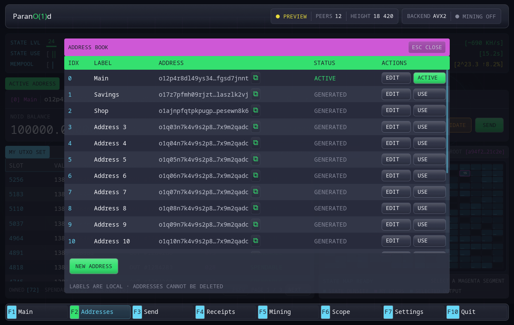

# Адреса

Кошелёк детерминированно создаёт индексированные адреса из одного
мастер-секрета. Адрес `0` появляется при первичной настройке и получает имя
**Основной**. Дополнительные адреса создаются в адресной книге.

## Адресная книга

Нажмите `F2` или выберите **Адреса**. Таблица показывает:

- индекс адреса;
- локальную метку;
- адрес;
- является ли адрес активным.

Метки хранятся только локально и не относятся к консенсусу.

## Создание адреса

Нажмите **Новый адрес**. Кошелёк создаст адрес со следующим индексом и добавит
его в список. Новый адрес не становится активным автоматически.

Копируйте адрес кнопкой рядом с ним. Parano1d использует представление
bech32m вида `o1…`; передавать нужно всю строку целиком.

## Смена активного адреса

Для неактивной строки нажмите **Использовать**. Активный адрес определяет:

- владельца UTXO, которые можно потратить в новом платеже;
- адрес возврата сдачи;
- адрес выплаты встроенного майнера по умолчанию.

Переключение недоступно, пока кошелёк выполняет локальную отправку,
консолидацию или активацию. Так завершённое доказательство не сможет попасть в
интерфейс уже другого владельца.

Текущая работа майнера сохраняет адрес выплаты, зафиксированный в неизменяемом
шаблоне. Новые шаблоны используют новый активный адрес.

## Адреса после восстановления

После импорта мастер-секрета кошелёк последовательно проверяет производные
адреса. Он добавляет непрерывную последовательность адресов с балансом и
останавливается на первом пустом адресе либо после 20 проверенных кандидатов.

Граница задана намеренно: нода не перебирает бесконечное пространство
производных адресов и не хранит индекс чужого кошелька.

## Перевод на другой адрес своего кошелька

Перевод с активного адреса на неактивный адрес того же кошелька считается
обычным платежом другому владельцу и получает полноценный чек.

Консолидация устроена иначе: средства тратит и получает один и тот же активный
владелец, поэтому платёжный чек не создаётся.
