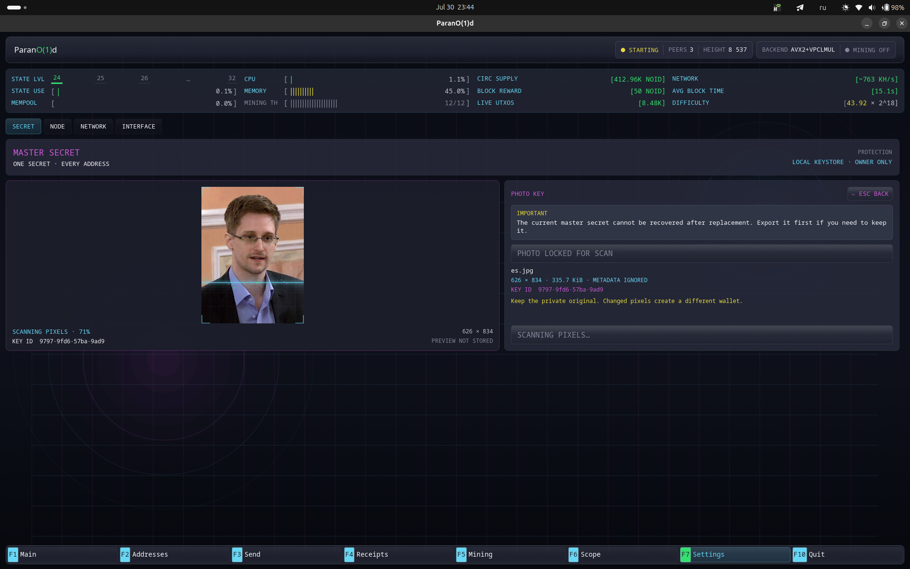

# Ключ из фотографии

Кошелёк умеет получать 256-битный мастер-секрет из изображения. Он не прячет
готовый ключ внутри файла: источником ключа служат декодированные пиксели.
Одинаковые пиксели воссоздают тот же кошелёк и каждый его производный адрес.



## Какие данные читает кошелёк

Кошелёк декодирует выбранное изображение, переводит его в канонический поток
RGBA-пикселей и передаёт следующие данные в режим BLAKE3 `derive-key` с разделением доменов:

```text
"RGBA8" || width_le32 || height_le32 || pixel_length_le64 || rgba_pixels
```

Контекст получения ключа закреплён форматом кошелька:

```text
Parano1d master secret from canonical image pixels v1
```

32-байтный результат становится мастер-секретом.

Имя файла и метаданные изображения во вход не входят. Поэтому два файла с
одинаковыми декодированными размерами и пикселями дадут один ключ, даже если
их метаданные различаются.

Короткий **Key ID**, который показывается до импорта, — отдельный доменно
разделённый отпечаток полученного ключа. Сравнивайте его при проверке
резервной копии на другом устройстве.

## Какие данные остаются закрытыми

Изображение обрабатывается локально. Оно не загружается в сеть, не попадает в
транзакцию и не копируется в каталог данных кошелька. После настройки
хранилище содержит полученный мастер-секрет — точно так же, как после
создания или импорта обычного ключа.

С точки зрения консенсуса владелец, созданный из фотографии, ничем не отличается
от любого другого владельца Parano1d. Фото — лишь выбранный человеком источник того
же 256-битного секрета кошелька.

## Выбор фотографии

Используйте непубличный оригинал, который никогда не публиковался. Публичное или
легко угадываемое изображение не является секретом: любой человек с теми же
пикселями получит тот же кошелёк.

Храните исходный файл офлайн. Другой кошелёк получится после любого из
следующих изменений:

- изменение размера, обрезка или поворот пикселей;
- фильтры и цветокоррекция;
- преобразование с потерями;
- сжатие мессенджером или социальной сетью;
- снимок экрана или миниатюра оригинала.

Перенося резервную копию между своими устройствами, отправляйте изображение
как файл, а не как оптимизированную картинку. Метаданные могут безопасно
меняться, однако сохранение исходного файла — самый простой надёжный способ
восстановления.

До получения средств прочитайте раздел
[Резервное копирование и восстановление](backup-recovery.md).
