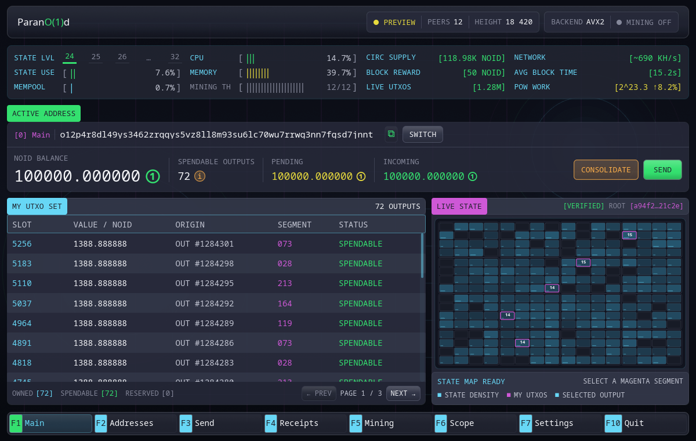

# 钱包

原生钱包本身就是一个完整节点应用。它在同一台设备上派生地址、证明花费
权限、提交交易、跟踪 [Live State](../reference/glossary.md#live-state)、验证区块并保存付款收据。

随附节点是应用的私有组件。钱包无需终端即可启动它，通过本地 RPC 与其
通信，并在退出时正常关闭节点。



文档中已填充的钱包页面使用内置预览数据。图中的地址、余额、区块和交易
标识符仅用于说明。

## 导航

| 按键 | 页面 | 用途 |
|---|---|---|
| `F1` | 主页 | 活动地址、余额、UTXO 与 Live State 图 |
| `F2` | 地址 | 派生地址与活动地址选择 |
| `F3` | 发送 | 构建、证明并提交付款 |
| `F4` | 收据 | 已保存的外发收据与独立验证 |
| `F5` | 挖矿 | 内置矿工控制和本机挖出的区块 |
| `F6` | 搜索 | 查询当前 Live State、区块和保留交易 |
| `F7` | 设置 | 密钥、节点、网络和界面选项 |
| `F10` | 退出 | 停止受管节点并关闭应用 |

`Esc` 用于退出详情页和关闭对话框。

## [活动地址](../reference/glossary.md#active-address)

同一时间只有一个派生地址处于活动状态。它决定：

- 新付款从哪个地址对应所有者的 UTXO 取输入；
- 找零返回到哪个地址；
- 内置矿工默认的奖励地址。

钱包仍会扫描并显示已生成的非活动地址，但不会把它们的 UTXO 静默合并到
活动地址发起的付款中。

## 本地证明

选择 **证明并发送** 后，钱包会锁定表单并构建新的授权证明封装。本地操作
优先使用 CPU，挖矿会主动让出资源。密钥从不进入交易字段，也不会离开钱包
进程。

提交成功后，最终面板会显示逻辑交易 ID 和公开的付款事实。节点继续跟踪
确认，钱包随后保存收据。

## 本地数据

Linux 和 macOS 的默认数据目录为：

```text
~/.parano1d/data
```

Windows 使用用户配置文件下对应的 `.parano1d\data` 目录。

主密钥保存在 `wallet.key`，收据保存在 `wallet.receipts`，界面偏好位于
`~/.parano1d/gui-settings.json`。

主密钥文件没有密码加密。请保护操作系统账户，并在收款前备份密钥。

可以从[首次运行](first-run.md)开始，了解
[如何用照片生成钱包密钥](photo-key.md)，或直接阅读
[备份与恢复](backup-recovery.md)。
