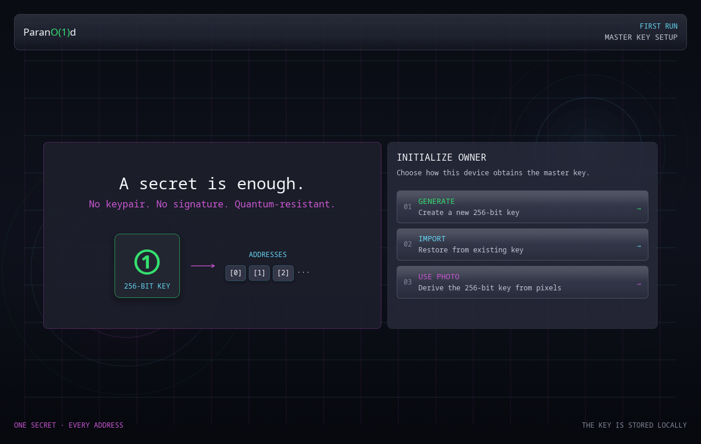

# First run and the master secret

The first-run flow creates or restores the single 256-bit secret from which the
wallet derives every address.

## Generate

**Create a new 256-bit key** uses operating-system randomness and installs the
new master secret locally.

Export or back it up before funding the wallet. The project cannot regenerate
it from an address or receipt.

## Import

**Restore from existing key** accepts exactly 64 hexadecimal characters,
representing 32 bytes.

After import, the wallet checks derived addresses in order. Discovery stops at
the first address with no live UTXO or after 20 funded addresses, whichever
comes first. This contiguous-prefix rule avoids an unbounded address scan of State.

Addresses beyond the first unused index are not found automatically. Generate
or inspect them explicitly if the previous wallet used a non-contiguous address
range.

Import restores spending authority and current on-chain balance. It does not
restore locally saved receipts.

## Use photo

**Derive the 256-bit key from pixels** decodes an image and derives the master
secret from its pixel content. The image is processed locally and is not
copied into wallet storage.

Use a private original and preserve it without pixel changes. The dedicated
[Photo-derived key](photo-key.md) guide explains derivation, the Key ID and
safe recovery.

## What is installed

The wallet stores a 48-byte `wallet.key` file: a format marker followed by the
32-byte secret. On Unix it requires owner-only permissions and rejects a file
with the wrong owner or mode.

Replacing the master secret changes the complete derived address set. The
Settings page requires an explicit confirmation and warns before replacement.

Continue with [Addresses](addresses.md) and
[Backup and recovery](backup-recovery.md).
